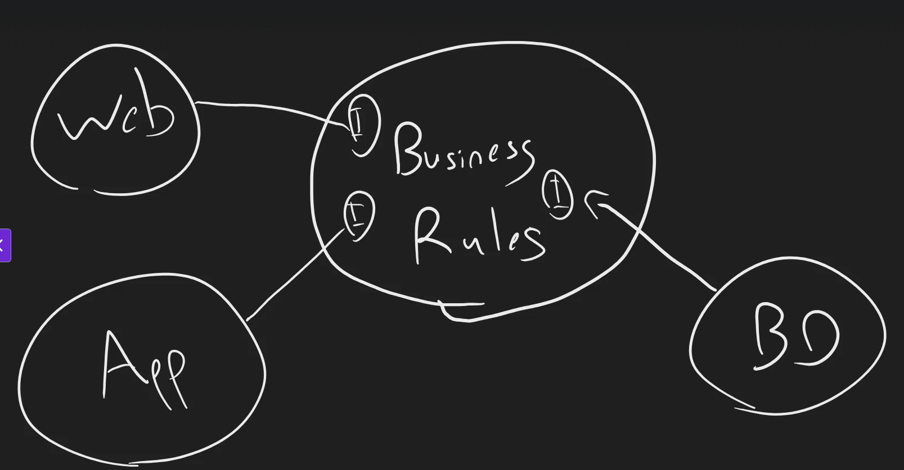
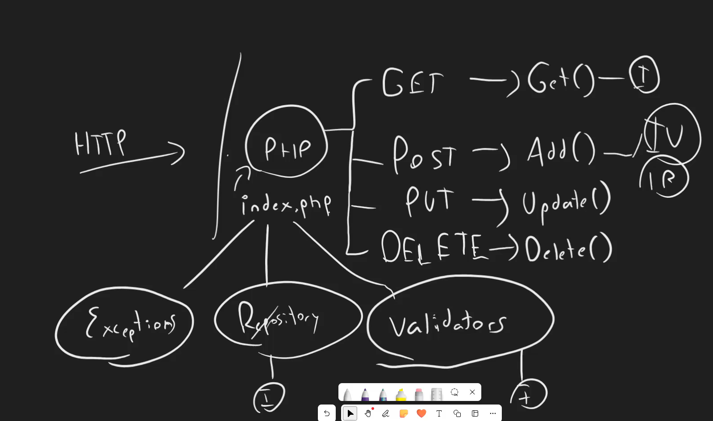

## Reglas de negocio

En arquitectura de software, las reglas de negocio son las reglas que definen el comportamiento de la aplicación. Se les conoce como funcionalidades de alto nivel, porque definen el comportamiento de la aplicación. Define el flujo operacion del negocio.

Las funcionalidades de bajo nivel son como se muestran las cosas, como se guardan las cosas la base de datos, como se calculan las cosas el protocolo, como se envian las cosas el protocolo de red, etc.

Las reglas de negocio invovan interfaces que son implementadas por las funcionalidades de bajo nivel. Por lo tanto, las reglas de negocio no dependen de las funcionalidades de bajo nivel.

Una arquitectura de software es una forma en la que estructuramos el software para que sea mantenible, escalable y extensible.
Se crean formas en la cuales se separa la logica de negocio de la logica de la base de datos, la logica de la red, etc.

## Definición de responsabilidades

La definición de responsabilidades es la forma en la que se define la responsabilidad de cada componente.

En la aplicacion tenemos una solicitud HTTP, y vamos a detectar que solicitud se manda y apartir de esto invocamos una funcionalidad.
La implementacion de repository es la que se encarga de la logica de la base de datos. -> Interfaz
Validaciones, que se encargan de validar los datos que vienen de la solicitud HTTP. -> Interfaz
Excepciones, que se encargan de manejar los errores que vienen cuando ocurre algo fuera de lo comun.

El funcionamiento de las interfaces estaran abiertos para la extension y cerrados para la modificacion.

