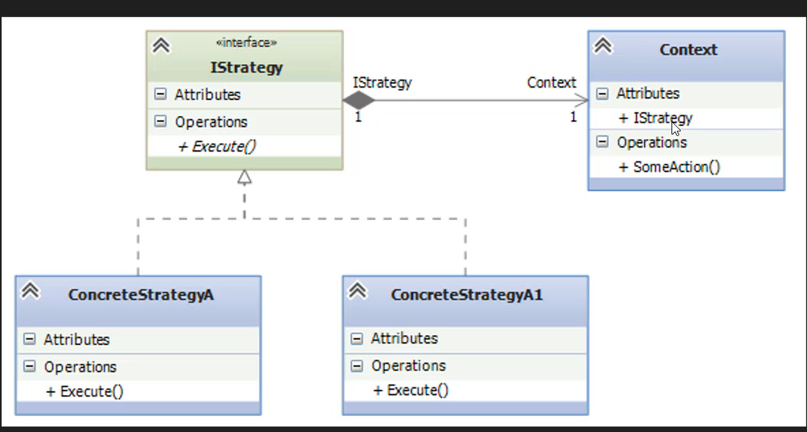
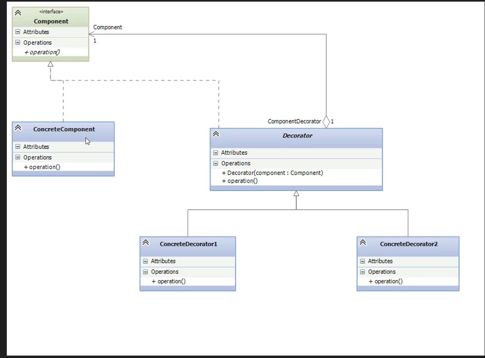
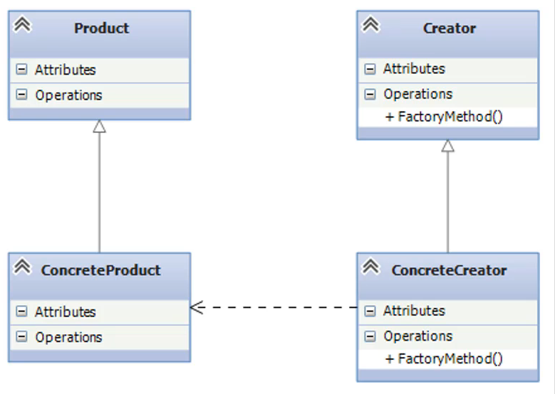

## Patrones de diseño

Un patron de diseño es una tecnica para resolver problemas comunes o habituales, para no reinventar la rueda.

Los patrones de diseño se dividen en 3 tipos:

- Creacionales: Estrategias de creacion de objetos dependiendo si el objeto es my grande o pequeño, o dinamico.

- Estructurales: Estructuracion de herencia y composicion, de las clase para cuando necesitemos una organizacion de las clases para ciertos problemas.

- Comportamentales: Forma de organizar las clases he interfaces para comportamientos en especificos.

## Patron de diseño de comportamiento strategy

El patron de diseño strategy es un patron de diseño comportamental que nos permite definir una familia de algoritmos, encapsular cada uno de ellos, y hacerlos intercambiables.

## Patron de diseño estructural decorator

Sirve para darle funcionamiento dinamico a objetos ya existentes sin necesidad de heredarlos. Como se van a ensamblar estos objetos para tener una estructura. Como se relacionan estos objetos para generar una estructura.
El patron decorador es como una envoltura, es decir una bolsa en sima de otra bolsa, es decir una capa sobre otra capa.

## Patron de diseño creacional factory method

Es un patron de diseño creacional que nos permite crear objetos sin especificar la clase exacta de objeto que se va a crear. Es decir no conocemos exactamente el tipo de objeto que se va a crear.

Por ejemplo si te conectas a una base de datos, no sabes exactamente que tipo de base de datos es, pero sabes que tipo de base de datos es. Se conoce la interface, pero no el tipo exacto de objeto que se va a crear. En resumen factori es una fabrica que nos permite crear objetos sin especificar la clase exacta de objeto que se va a crear.

