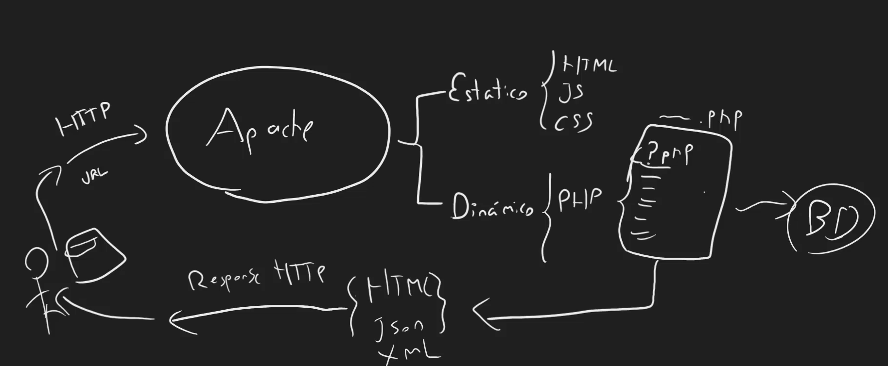
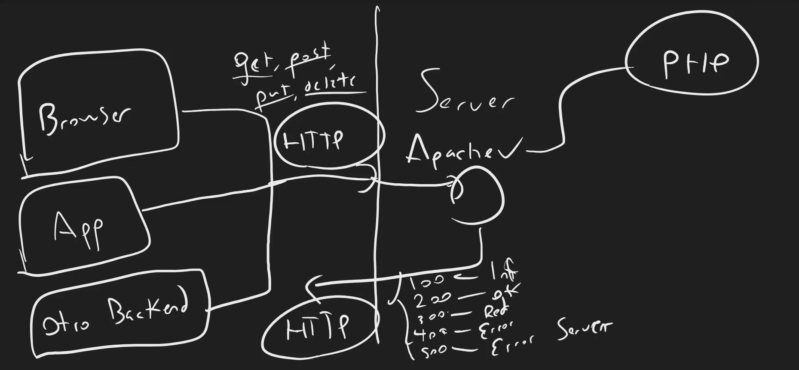
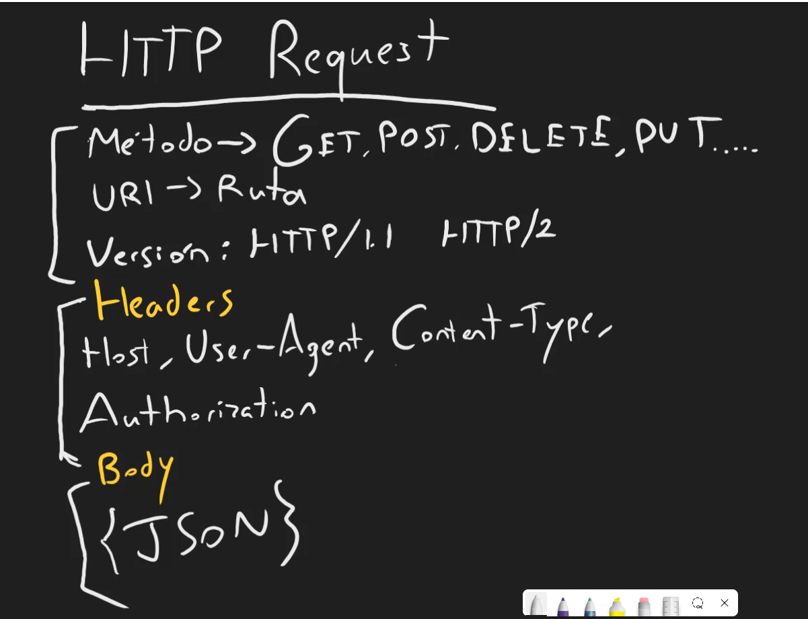
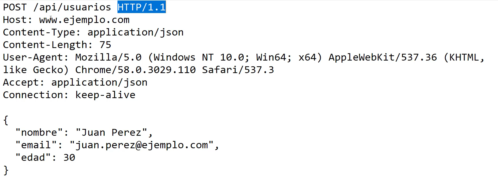
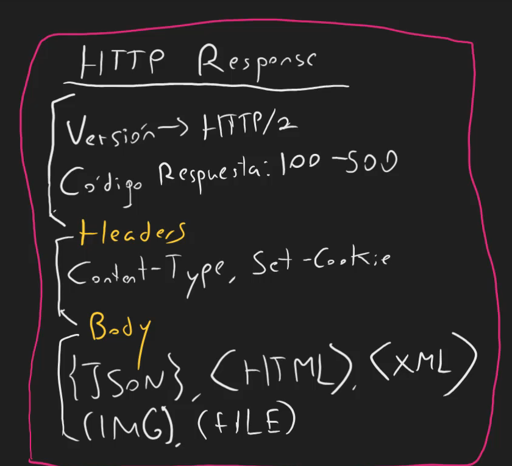
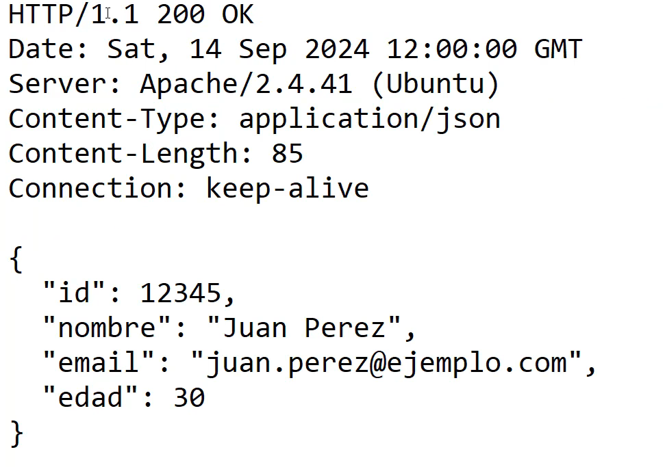

## Como funciona Apache y PHP

Apache es un servidor web que se encarga de recibir peticiones (solicitudes) HTTP y estan van a una URL, se le dice a Apache que vaya a esa url y busque el archivo que se le pide. El verifica si el contenido es estatico (html, css, js, img, etc) o dinamico (php, node, python, etc). En el caso de contenido dinamico con PHP, php procesa el archivo generar contenido html, xml, json, consulta a la base de datos, etc y lo envia al navegador de forma estatica, esto seria una respuesta HTTP(response). Lo va obtener quien lo solicita, el navegador o el cliente.

## Solicitud HTTP

Cuando trabajamos con backend tenemos una aplicacion que sirve como servidor, como apache, nginx, etc. Vamos a PHP a interpretar el archivo que se le pide, el browser, hardware, movil, etc envia la solicitud HTTP al servidor, el servidor responde con la solicitud HTTP.

HTTP es un protocolo que sirve par aplicaciones cliente servidor. El backend interpreta el mensaje http y retorna una respuesta http. En la peticion se pueden enviar datos al mismo servidor y que se realicen acciones, como insertar, eliminar, actualizar, datos en la base de datos, etc.
Los tipos de peticiones HTTP son: GET, POST, PUT, DELETE, PATCH, OPTIONS, HEAD.

GET: Obtiene datos del servidor.
POST: Envía datos al servidor.
PUT: Actualiza datos en el servidor.
DELETE: Elimina datos del servidor.
PATCH: Actualiza datos parciales en el servidor.
OPTIONS: Obtiene información sobre las peticiones que se pueden hacer al servidor.
HEAD: Obtiene información sobre el servidor.

Si se realiza un peticion HTTP tiene diferentes codigos de estado que indican si la peticion se realizo correctamente o no.

200: OK
201: Created
204: No Content
301: Moved Permanently
302: Found
400: Bad Request
401: Unauthorized
403: Forbidden
404: Not Found
500: Internal Server Error
502: Bad Gateway
503: Service Unavailable
504: Gateway Timeout
Se envia el codigo y la respuesta al cliente, que realiza la solicitud HTTP.

## Partes de una solicitud HTTP (request)

Especifica la accion a realizar, un verbo HTTP o metodo HTTP.
Los mas utilizados son GET, POST, PUT, DELETE, PATCH.
Se tiene tambien la URL que se le pide al servidor (Ruta).
Se tiene tambien la version de HTTP que se esta utilizando.
Se tiene tambien los headers que son informacion adicional sobre la peticion(queines somos, que tipo de contenido estamos enviando, autorizacion, etc) .
Se tiene tambien el body que es el contenido de la peticion incluidos en el put, post, patch (datos que se envian al servidor, json).

### Ejemplo de solicitud HTTP POST

## Partes de una respuesta HTTP (response)

Version de HTTP que se esta utilizando.
Codigo de estado que indica si la peticion se realizo correctamente o no.
Headers que son informacion adicional sobre la respuesta (que tipo de contenido se esta enviando, autorizacion, etc) 100-500.
Header content type, cookies, etc.
Body que es el contenido de la respuesta (datos que se envian al cliente, json, html, xml, img, etc).

### Ejemplo de respuesta HTTP POST

## HTTP Response Status Code

Estos codigos de estado indican si la peticion se realizo correctamente o no. Se forman por 3 digitos.

100-199: Informational responses.

- 1XX: Informativos -> 100 Continue, 101 Switching Protocols, 102 Processing

200-299: Success responses.

- 2XX: Exitosos -> 200 OK, 201 Created, 204 No Content

300-399: Redirection responses.

- 3XX: Redireccion -> 301 Moved Permanently, 300 Multiple Choices, 302 Temporary Redirect

400-499: Client error responses.

- 4XX: Client error -> 400 Bad Request, 401 Unauthorized, 403 Forbidden, 404 Not Found

500-599: Server error responses.

- 5XX: Server error -> 500 Internal Server Error, 502 Bad Gateway, 503 Service Unavailable, 504 Gateway Timeout
